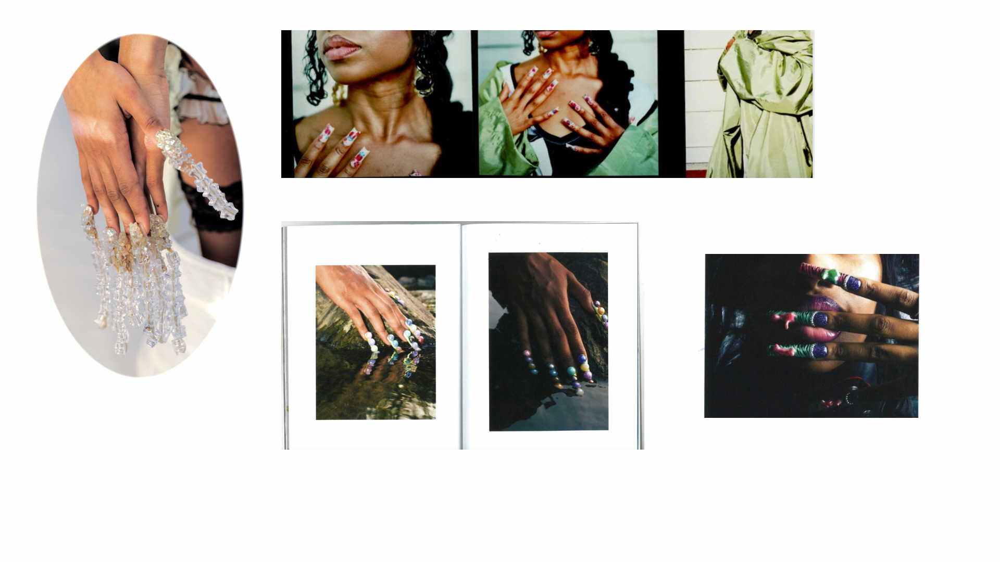

# Greetings 🌸 I'm Nataya Price 

## What can you find me doing? ⭐
I’m a visual artist and a creative concepts director and producer, a visionary who thrives on turning ideas into reality. Apart from creating beautiful nail sculptures and mastering the art of nail design, I've even ventured into the world of publishing with my own photo book. I also find joy in the simple things, like sitting down to reflect and letting my thoughts wander. Whenever I tackle a project, my motto is to do it 10 times better than before—I thrive on continuous improvement. I love learning and discovering new things every day. I believe in soaking up every bit of knowledge and enjoying every moment. I'm all about challenges, be it in my work or personal growth. The beauty of collaboration and forming connections organically is what keeps my creative juices flowing. 

## Things I Enjoy 💌
A lover of self-care rituals—indulging in skincare, haircare, and nails. Thriving on the satisfaction of meticulous projects like intricate nail designs, hairstyling, and sewing. Embracing the warmth of summer, reveling in the joy of research, and finding solace in nature. Balancing everything while spending quality time with family and friends. 

## Favorite Book Genres ⭐
A passionate reader, I explore diverse genres, from science fiction and Afro-futurism to mystery and period pieces. My reading journey is a continuous exploration. Currently immersed in Octavia Butler's "Lilith's Brood."

*NatayaP/NatayaP* is a ✨ special ✨ repository because its `README.md` (this file) appears on your GitHub profile.
You can click the Preview link to take a look at your changes.
