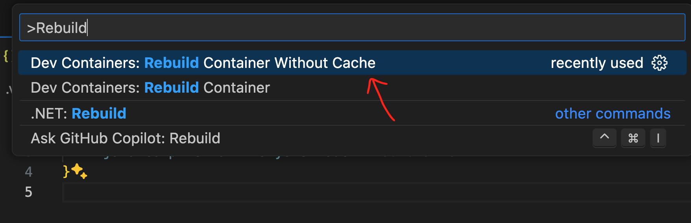
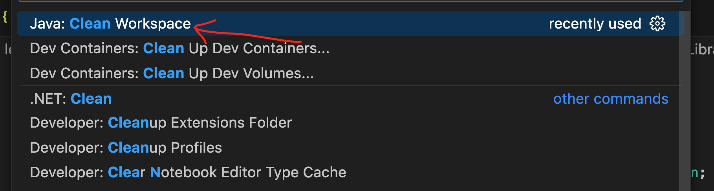

# Lesson 11

## Homework

* No additional assigned reading
* Continue working on [Lesson 10][lesson-10] homework assignment.
* Do the [housekeeping exercise](#housekeeping).

## Housekeeping

To help you complete the homework, I've updated the devcontainer configuration to provide some useful refactoring tools that will save you a substantial amount of time. Please read and follow these instructions carefully to get the latest goodness:

1. First, sync your fork and pull changes to your local machine.
2. Open the project folder BUT do not click the button to rebuild the container when prompted.
3. Press `Cmd ⌘ - Shift ⇧ - P` to open the Command Palette. Search for and execute the `Dev Containers: Rebuild Container Without Cache` option. If you get an error while attempting to start the container, just click `Retry` and it should move forward.

4. Let everything run for a couple of minutes to allow the extensions time to install.
5. Next, uninstall the [Extension Pack for Java][extension-pack] extension if it is still installed in VS Code.
6. At this point, you should now be using the improved [Java Platform Support][java-platform] extensions that provide more reliable refactoring and unit testing support.

## Using the VS Code refactoring tools.

Once you have the new tools setup, you should now be able to do things like rename a function or variable and update it everywhere it is used. You can [watch this YouTube video][renaming-video] to understand how this tooling works. 

## Troubleshooting
If you still run into issues here are some things you can try:

* Close VS Code and restart
* Clean the language server workspace by opening the Command Palette (`Cmd ⌘ - Shift ⇧ - P`) and searching for the `Java: Clean Workspace` option.

[lesson-10]: /lesson_10/
[extension-pack]: vscode:extension/vscjava.vscode-java-pack
[java-platform]: vscode:extension/Oracle.oracle-java
[renaming-video]: https://www.youtube.com/watch?v=S1Jzrmw0ww8